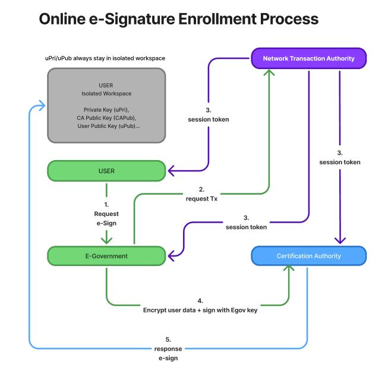

# Secure Workspace – Open Source Reference Implementation

**Goal:** Provide a transparent, verifiable, and secure client application for
decentralized e-signature workflows. Maintained under the governance of
the Secure Workspace consortium (E-Government, CAs, independent reviewers).

## Key Features
- **Client-side key generation:** Private keys are generated on the user's device and never leave it.
- **Isolated workspace:** All signing operations run inside a secure environment (TEE / Secure Enclave).
- **Attestation:** Device attestation and session token binding ensure the integrity of the signing environment.
- **Ephemeral certificates:** Certificates are generated per transaction and revoked immediately after use.
- **Reproducible builds:** Signed releases with verifiable checksums guarantee transparency.

## Architecture Overview
- **Isolated Workspace:** Stores the user’s private key (`uPri`) and public key (`uPub`). Keys are never exported.
- **Certification Authority (CA):** Issues ephemeral certificates and validates signed transactions.
- **Network Transaction Authority (NTA):** Coordinates session tokens and transaction lifecycles.
- **E-Government (or Relying Party):** Requests and validates user signatures for official processes.

## Workflow Summary
1. The user requests an e-signature operation through the e-government portal.
2. A transaction request (`Tx`) is created and forwarded to the CA.
3. The NTA issues a session token and provides it to both the CA and the e-government system.
4. The CA generates an ephemeral public key (`nPub`), sends it to the user's isolated workspace for signing.
5. The user signs `nPub` with their private key (`uPri`), and returns the signed value to the CA.
6. The CA validates the signature, issues an ephemeral certificate, and immediately marks it for revocation after use.
7. The e-government system finalizes the transaction with a verified and trusted signature.

## Components
- `api/` – OpenAPI schema and protocol definitions
- `examples/` – Minimal WebAuthn PoC (client + server)
- `docs/` – Architecture diagrams and threat models
- `scripts/` – Developer tools (lint, format, build automation)

## Security Principles
- **Key protection:** User keys are never exported from the isolated workspace.
- **Tamper resistance:** Attestation proves the client device and secure environment are uncompromised.
- **Transaction binding:** Each signature is bound to a unique session token to prevent replay attacks.
- **Auditable:** All releases are reproducible and cryptographically signed.

## Contributing
Please read [CONTRIBUTING.md](CONTRIBUTING.md) and [GOVERNANCE.md](GOVERNANCE.md) before submitting a pull request.  
All changes must pass security review and be approved by designated code owners.

## License
Licensed under [MPL-2.0](LICENSE).  
**Note:** Forking is not allowed. See [GOVERNANCE.md](GOVERNANCE.md) for contribution and release policies.
